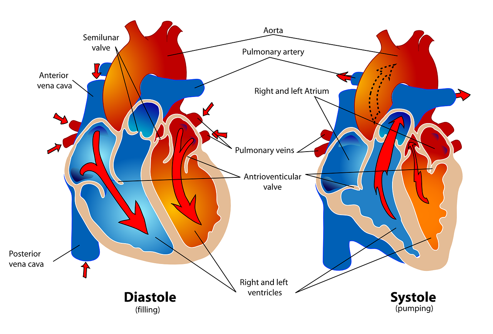
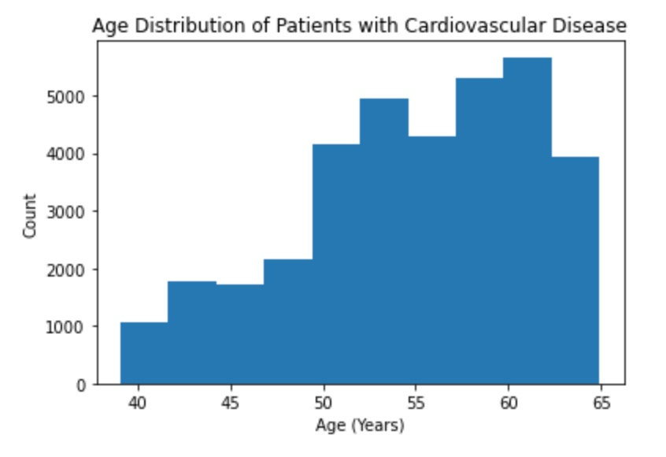

# Cardiovascular Disease: Can health data predict whether or not a patient has cardiovascular disease?

## Overview
Heart disease is one of the most prevalent diseases in the world and one of the leading causes of death in the United States. Many of us have heard of the risk factors that put you at risk for cardiovascular disease, such as genetics, exercise, diet, weight, etc. How much of a risk are these risk factors? Can these risk factors actually predict wheter or not a person will develop cardiovascular disease? In order to answer these questions I expolored a cardiovascular disease dataset from Kaggle. This dataset contains 70000 patient records and consits of 3 types of input features: Objective: factual information, Examination: results of medical examination, and Subjective: information given by the patient. The data set includes the following columns:
-Age (days)
-Height (cm)
-Weight (kg)
-Gender
-Systolic blood pressure
-Diastolic blood pressure
-Cholesterol (1: normal, 2: above normal, 3: well above normal)
-Glucose (1: normal, 2: above normal, 3: well above normal )
-Smoking
-Alcohol intake
-Physical activity.

## Does gender make a person more likly to develop cardiovascular disease?

Yes! Based on this data, men are slightly more likely to develop cardiovascular disease than women. Men have a 50.5% chance and women have a 49.7% chance of developing cardiovascular disease. It is important to note that more women were included in this data than were men and that this statistic was calculated proportionally to avoid errors.

## Is there a relationship between BMI and developing cardiovascular disease?
This is how BMI is calculated and measured:
BMI = weight(kg) / height(m)^2
BMI Categories:
-Underweight: <18.5
-Normal: 18.5-25
-Overweight: 25-30
-Obese: > 30

Patients that fall into the overweight or obese category are more likely to develop cardiovascular disease than patients that have a normal BMI. There were 12290 patients with an overweight BMI and 11651 pateints with an obese BMI that had cardiovascular disease. That is a combined total of 24,447 people meaning that more than one-third of the patients in the dataset had a high BMI and cardiovascular disease! Of those with a normal BMI, 10350 still developed cardiovascular disase. This indicates that BMI is an important factor, but certainly not the only important factor. There were 15440 patients with a normal BMI that did not have cardiovascular disase though. Interestingly, of the small number of patients with underweight BMIs, there were more people that developed cardiovascular disease than did not. This indicates that maintaing a normal BMI is important to maintain good heart health.

## What is the relationship between age and cardiovascular disease?
Patients over the age of 55 are more likely to develop cardiovascular disease. Age definitely plays a huge role in the development of this disease, so it is especially important to maintain a healthy lifestyle as you age. 

## Can the variables in this dataset predict whether or not a person will develop cardiovascular disase?
Yes! In order to answer this question, I used a machine learning approach called Decision Tree Regression. This approach created a model that determined whether or not the factors in this dataset could predict whether or not the patient would develop cardiovascular disease or not without knowing if the patient had the disease or not. The model was able to make a highly accurate prediction. The accuracy can be determined by the absolute mean error. The lower the absolute mean error, the better. I had an 0.00024285714285714286, so the model was very accurate.

## Summary:
The combination of age, height, weight, gender, blood pressure, cholesterol, smoking, alcohol intake, and physical activity can predict if a person will develop cardiovascular disase or not. The data is overwhelmingly true! While there are some factors like age and genetics that we can't control, we do have more control of our lifestyle choices. My recommendation is to try to live a healthy lifestyle to prevent developing cardiovascular disease as much as possible (Full disclosure: I am not a medical doctor, this is just a fun data analysis project).  Thanks for reading and stay healthy!

## Sources:
[1] https://www.kaggle.com/datasets/sulianova/cardiovascular-disease-dataset
[2] https://www.makeareadme.com/ 
[3] https://mljar.com/blog/visualize-decision-tree/
[4] https://www.diabetes.ca/managing-my-diabetes/tools---resources/body-mass-index-(bmi)-calculator#:~:text=How%20to%20calculate%20Body%20Mass,range%20is%2018.5%20to%2024.9.
